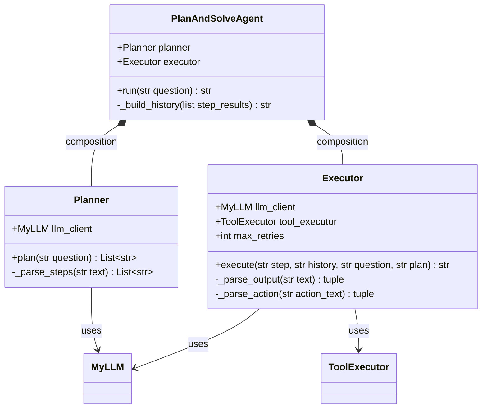
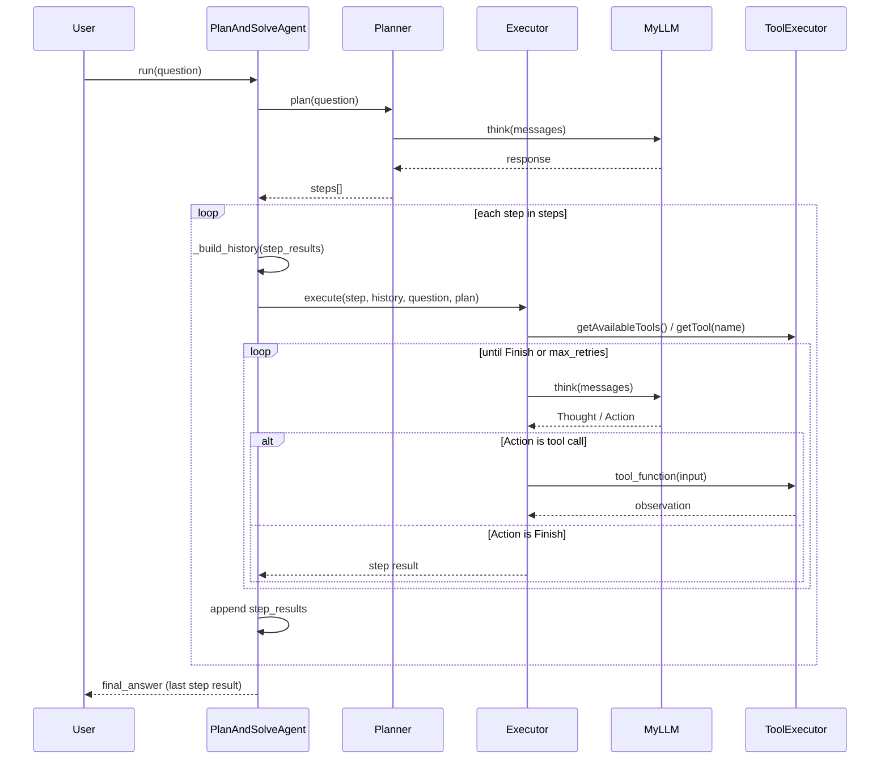

# `plan_and_solve_agent.py` 类图与运行时序

本文档描述 [plan_and_solve_agent.py](../plan_and_solve_agent.py) 中的核心类型及其协作方式。可在支持 Mermaid 的编辑器中预览（如 Cursor / VS Code Markdown 预览）。

## 类图（静态结构）

说明：`PlanAndSolveAgent` 通过组合持有 `Planner` 与 `Executor`；`Planner` 与 `Executor` 依赖 `MyLLM`；`Executor` 额外依赖 `ToolExecutor` 以注册与调用工具。无继承关系。

## 序列图（`run` 主流程）

说明：`run` 先调用 `planner.plan` 得到步骤列表，再对每一步调用 `executor.execute`；前序步骤结果经 `_build_history` 拼成历史字符串传入下一步。

